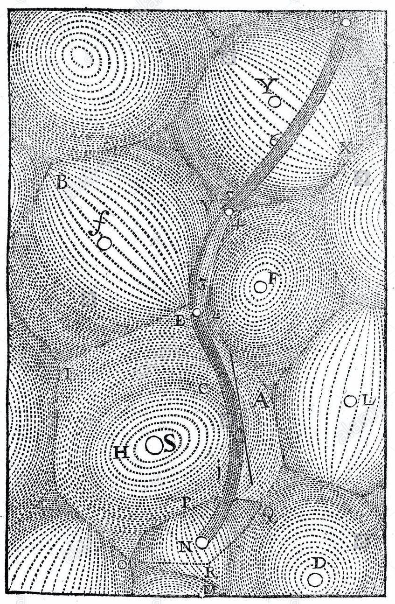

Descartes' mechanical view of a universe filled with plenum and a system of vortexes that carries planets around the sun. Descartes proposed in 1644 that no empty space can exist and that space must consequently be filled with matter. The parts of this matter tend to move in straight paths, but because they lie close together, they can not move freely, which according to Descartes implies that every motion is circular, so the ether is filled with vortices.