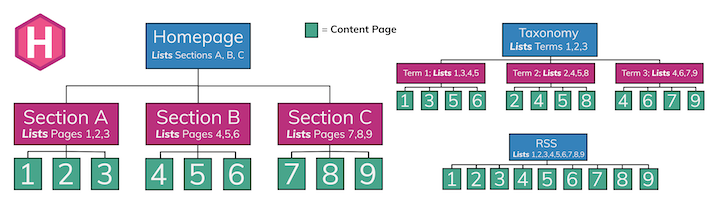

#### hugo docs 참고

- <a href="https://gohugo.io/content-management/organization/" target="_blank">컨텐츠 오거나이제이션</a>
- <a href="https://gohugo.io/content-management/page-bundles/" target="_blank">페이지 번들</a>
- <a href="https://gohugo.io/content-management/sections/" target="_blank">컨텐트 섹션</a>
- <a href="https://gohugo.io/content-management/types/" target="_blank">컨텐트 타입</a>
- <a href="https://gohugo.io/content-management/taxonomies/" target="_blank">카테고리와 태그(Taxonomies)</a>
- <a href="https://gohugo.io/content-management/menus/" target="_blank">메뉴</a>
- <a href="https://gohugo.io/templates/lists/" target="_blank">리스트 페이지 템플릿</a>
- <a href="https://gohugo.io/templates/section-templates/" target="_blank">섹션 페이지 템플릿</a>
- <a href="https://gohugo.io/templates/taxonomy-templates/" target="_blank">Taxonomy 템플릿</a>
- <a href="https://gohugo.io/templates/menu-templates/" target="_blank">메뉴 템플릿</a>


## 리스트 페이지와 컨텐트 페이지

hugo의 리스트 페이지 아이디어는 [hierarchical mental model of the web](https://webstyleguide.com/wsg3/3-information-architecture/3-site-structure.html)에서 비롯된다.
리스트 페이지와 컨텐트 페이지의 아이디어는 다음 그림에 잘 나타나있다.



리스트 페이지는 여러 개의 컨텐츠를 하나의 html 페이지에 리스트 형식으로 보여줄 필요가 있다.
그래서 single 템플릿과 별도로 리스트 페이지 템플릿을 둔다.

리스트 페이지에는 다음과 같은 것들이 있다.

- Taxonomy terms pages
- Taxonomy list pages
- Section list pages
- RSS

섹션 페이지는 중첩될 수 있다.
`content`의 바로 아래 폴더는 섹션 폴더이며, 변경할 수 없다.
그 아래 폴더가 컨텐트 파일 `_index.md`를 가지면 섹션 페이지로 취급된다.

```
content
└── blog                    <-- Section, because first-level dir under content/
    ├── funny-cats
    │   ├── mypost.md
    │   └── kittens         <-- Section, because contains _index.md
    │       └── _index.md
    └── tech                <-- Section, because contains _index.md
        └── _index.md
```

컨텐트 페이지의 디폴트 템플릿은 `layouts/_default/single.html`이고,
리스트 페이지의 디폴트 템플릿은 `layouts/_default/list.html`로 지정되어 있다.
루트 section 페이지와 taxonomy 페이지는 `layouts/_default`에 각각 `section.html`과 `taxonomy.html` 템플릿이 있으면 이것을 사용한다.

다음은 간단한 리스트 페이지 템플릿의 예시이다.

```go-html-template
<!doctype html>
<html lang="ko">
  <head>
    <title>{{ .Title }}</title>
  </head>
  <body>
    <header>
      {{ .Permalink }}
      <h1>{{ .Title }}</h1>
    </header>
    <div>
      {{ .Content }}
    </div>
    <div>
      {{ range .Pages }}
        <p>
          <a href="{{ .Permalink }}">{{ .Date.Format "2006-01-02" }} | {{ .Title }}</a>
        </p>
      {{ end }}
    </div>
    <footer>
      저작권 표시, 기타.(예시: (c) measurable, 2019.)
    </footer>
  </body>
</html>
```

