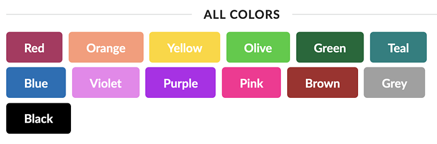

## 테마 사용

### Sitewide Defaults
Semantic UI includes twelve named colors. Components with color variations inherit these global variables when defining how colors should appear.

Each level of inheritance includes a special file site.variables which defines theme-wide defaults that each component can extend.

Global variables use higher level abstractions, to avoid tedium in having to modify multiple properties to change the appearance of an element.

Other button shades like those used in hover, active and focus states are created by modifying the saturation and lightness of color variables, these derived variables will automatically adjust to your new color palette.

`site/globals/site.variablesless`

```css
@primaryColor   : @pink;
@secondaryColor : @grey;
@red            : #B03060;
@orange         : #FE9A76;
@yellow         : #FFD700;
@olive          : #32CD32;
@green          : #016936;
@teal           : #008080;
@blue           : #0E6EB8;
@violet         : #EE82EE;
@purple         : #B413EC;
@pink           : #FF1493;
@brown          : #A52A2A;
@grey           : #A0A0A0;
@black          : #000000;
```



### Component Defaults
Components inherit default values from `site.variables` which they may redefine specifically for their component

For example, you could decide that instead of the boring default grey checkboxes, you want yours to include your site's branded colors. This can be accomplished in just a few variables.

`site/modules/checkbox.variablesless`

```css
/* Checkbox */
@checkboxActiveBackground: @primaryColor;
@checkboxActiveBorderColor: @primaryColor;
@checkboxActiveCheckColor: @white;
/* Focused Checkbox */
@checkboxActiveFocusBackground: @primaryColorFocus;
@checkboxActiveFocusBorderColor: @primaryColorFocus;
@checkboxActiveFocusCheckColor: @white;
@checkboxTransition: none;
/* Radio */
@radioActiveBackground: @white;
@radioActiveBorderColor: @primaryColor;
@radioActiveBulletColor: @primaryColor;
/* Focused Radio */
@radioActiveFocusBackground: @white;
@radioActiveFocusBorderColor: @primaryColorFocus;
@radioActiveFocusBulletColor: @primaryColorFocus;
/* Slider */
@sliderOnLineColor: @primaryColor;
/* Focused Slider */
@sliderOnFocusLineColor: @primaryColorFocus;
```

### Using Packaged Themes

When you download Semantic UI all components will be set up to use the default theme. Semantic uses a special file `theme.config` for controlling your project's packaged theming configuration.

Packaged themes are applied per component, and not globally. This means you can specify individual themes for each component, mixing and matching from available themes.

The default `theme.config` will have all component values set to default.
**To choose a theme, simply change a component to match the theme name.**

For example:

`src/theme.config`

```css
/*******************************
        Theme Selection
*******************************/
 /* Global */
@site       : 'material';  /* Loads material site defaults */
@reset      : 'default';
 /* Elements */
@button     : 'github'; /* But uses them with GitHub Buttons */
@container  : 'default';
@divider    : 'default';
@flag       : 'default';
@header     : 'default';
@icon       : 'default';
@image      : 'default';
@input      : 'default';
@label      : 'default';
@list       : 'default';
@loader     : 'default';
@rail       : 'default';
@reveal     : 'default';
@segment    : 'default';
@step       : 'default';
 /* Collections */
@breadcrumb : 'default';
@form       : 'default';
@grid       : 'default';
@menu       : 'chubby'; /* Other UI can use different themes as well */
@message    : 'default';
@table      : 'default';
 /* Modules */
@accordion  : 'default';
@checkbox   : 'default';
@dimmer     : 'default';
@dropdown   : 'default';
@embed      : 'default';
@modal      : 'default';
@nag        : 'default';
@popup      : 'default';
@progress   : 'default';
@rating     : 'default';
@search     : 'default';
@shape      : 'default';
@sidebar    : 'default';
@sticky     : 'default';
@tab        : 'default';
@transition : 'default';
 /* Views */
@ad         : 'default';
@card       : 'default';
@comment    : 'default';
@feed       : 'default';
@item       : 'default';
@statistic  : 'default';
```

### Browsing for Themes

Each UI definitions include a dropdown at the top of the page to preview themes included with the project.

Themes are per component, so although, for example, material themes are available for menu, button, and site, changing all values to "material" will produce an error for components which are not included in that theme.


------
## 테마 작성

### Definition File

Each component includes a source CSS and Javascript file which declares how a components variables should affect its display on screen. Definition files are updated with each new release of Semantic UI, which may also include new variables.

Navigating definition files are a great way for developers who are comfortable with CSS to get an idea of how themes affect a components display.

Here's an abridged version of button with an explanation of each section of the file.

`src/definitions/elements/button.lessless`

```css
/*******************************
            Theme
*******************************/

/* Define type and element to help locate theme files */
@type    : 'element';
@element : 'button';

/* Processes Variable Inheritance */
@import (multiple) '../../theme.config';

/* Create scope */
& {

/*******************************
           Button
*******************************/

/* Define Component */
.ui.button {
  cursor: pointer;
  display: inline-block;

  min-height: 1em;

  outline: none;
  border: none;
  vertical-align: @verticalAlign;
  background: @background;
  color: @textColor;

  font-family: @fontFamily;

  margin: 0em @horizontalMargin @verticalMargin 0em;
  padding: @verticalPadding @horizontalPadding (@verticalPadding + @shadowOffset);

  text-transform: @textTransform;
  text-shadow: @textShadow;
  font-weight: @fontWeight;
  line-height: @lineHeight;
  font-style: normal;
  text-align: center;
  text-decoration: none;

  border-radius: @borderRadius;
  box-shadow: @boxShadow;

  user-select: none;
  transition: @transition;
  will-change: @willChange;

  -webkit-tap-highlight-color: @tapColor;
}

/* Additional CSS removed for brevity */

/* Load CSS Overrides and Inline */
.loadUIOverrides();

}
```

### Theme Files

Themes are made up of two files: a .variables file and a .overrides file. A theme can include both variables and overrides, or just either one alone.

### Variables Files
A .variables file specifies variables which should be adjusted for a theme.

A theme's variable file only needs to include variables which are different for a theme.

### Override Files
An .overrides file specifies additional CSS rules to be added to a definition for a theme. This file also has access to all inherited variables for a component.

------
## cascading inheritance

Themes contain three separate levels of variable inheritance.

Each level of inheritance corresponds to a different level of permanence for a variable.

### Default Theme

The default theme provides baseline variables for a component.

The best way to understand what variables are available for inclusion in a theme is to examine a component's default .variables file.

### Packaged Theme

Packaged themes are themes bundled together in a folder for distribution. These can be downloaded from the internet, or carried between projects.

Packaged themes can be used by modifying values in your theme.config file.

### Site Theme

A site theme, not to be mistaken with site.variables a file located in every theme, is a special user theme that can be loaded on top of all other themes.

This is the best location to store changes that will be used on a single site. A site theme can be thought of as similar to a child theme in Wordpress.

Site theme files are optional includes and can be safely removed if you do not need to add additional changes to a component on your project.
