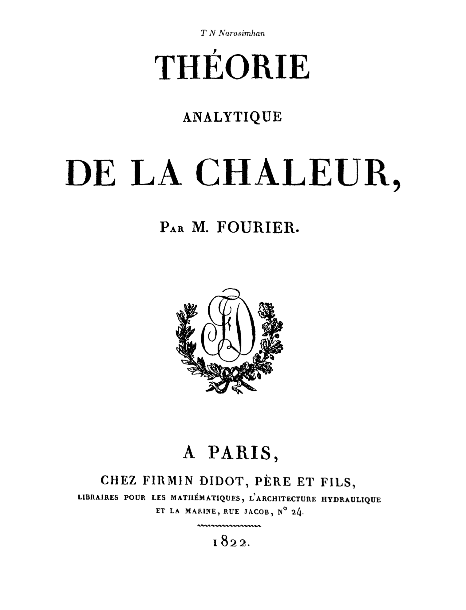

푸리에의 열방정식을 현대의 벡터 해석 표기법을 사용해서 나타내면 다음과 같다:
\\[
\divergence{K\grad T}=c\frac{\partial T}{\partial t}
\\]

\\(K\\)는 열전도율(thermal conductivity), \\(T\\)는 온도, \\(c\\)는 고체의 단위 부피당 비열용량(specific heat capacity)이다.[^fh-1]
이 방정식은 열이 흐르는 영역 내부에서 열이 보존된다는 의미를 가진다.

[^fh-1]: Narasimhan, p. 122

cf: 위키의 ([Heat equation](https://en.wikipedia.org/wiki/Heat_equation))항목에서는 처음부터 함수 \\(u(x,y,z,t)\\)을 써서 좀 더 일반적인 방식으로 도입하고 있다:
\\[
\frac{\partial u}{\partial t}=\alpha\left(\frac{\partial^2u}{\partial^2 x}+\frac{\partial^2u}{\partial^2 y}+\frac{\partial^2u}{\partial^2 z}\right)
\\]
이 때, \\(\alpha\\)는 실계수이며, 매질의 확산율(diffusivity)이라고 한다.
라플라시안을 사용해서 다음과 같이 간단히 나타낼 수 있다.
\\[
\dot u=\alpha\laplacian u.
\\]

다음 그림은 1차원에서 열방정식의 해를 나타낸다.

