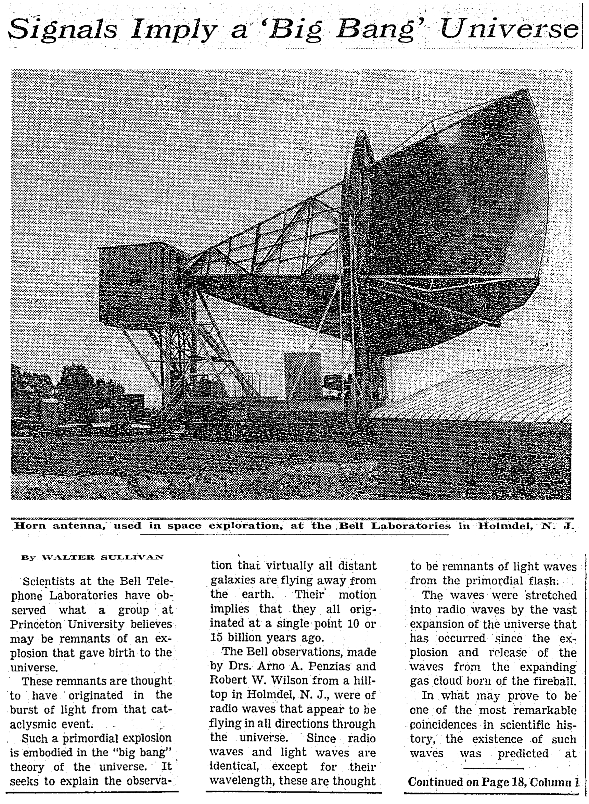

A. Penzias와 R. Wilson의 관측에 대한 뉴욕타임스의 1965년 5월 21일자 보도는 다음과 같이 시작한다.

>벨랩의 과학자들이 관측한 것을 프린스턴 대학 사람들은 우주가 탄생하는 폭발의 잔해일 것이라고 생각한다. (Scientists at the Bell Telephone Laboratories have observed what a group at Princeton University believes may be remnants of an explosion that gave birth to the universe.)

앨런 구스의 책 _The Inflationary Universe_\\(\\)에 따르면,
윌슨은 이 기사를 보고서야 비로소 그들이 본 것을 세상이 얼마다 진지하게 받아들이고 있는지 알았다고 말했다.

